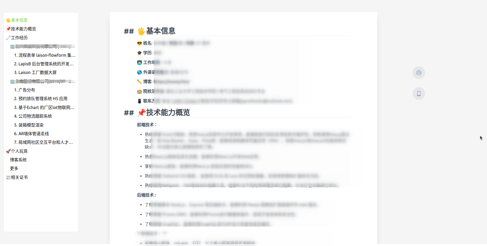
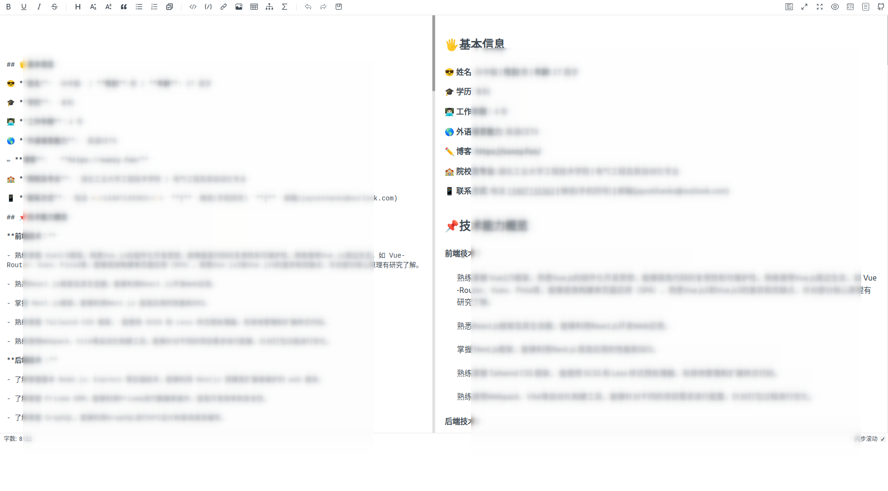

# resume-online

[toc]

一个超简单的在线 markdown 静态页面渲染，用来放放简历啦 (移动端已适配)。

>  based on vue3 + tailwind + node-express + nginx + docker

**展示页：**



**管理编辑页 ：(访问你所部署页面的 /admin 路由即可)**



### How to use

- step1:  fork 这个项目

- step2:  先在 `/web/index.html`中将 title 该成你自己需要的 title

  ```html
  <!-- 这里 -->
  <title>Change here to yours</title>
  ```

  然后，按需 在 `/web/.env` 中定义你的环境变量， 支持以下环境变量：

  | 变量字段                  | 描述                                                         | 是否可缺省 | 默认值            |
  | ------------------------- | ------------------------------------------------------------ | :--------: | ----------------- |
  | `VITE_ADMIN_PASSWD`       | /admin 的密码, 简历编辑页面的 密码                           |     ❌️      |                   |
  | `VITE_PASSWD`             | 简历首页访问的密码， 可缺省， 如果缺省或者设定为空字符串则会视作没有访问密码 |     ✔️      | 无                |
  | `VITE_PASSWD_INPUT_LABEL` | 提示密码输入的 `<input>` 框 `label` 值                       |     ✔️      | '请输入密码:'     |
  | `VITE_SUCCESS_TITLE`      | 密码正确时的提示 title                                       |     ✔️      | '成功'            |
  | `VITE_SUCCESS_CONTENT`    | 密码正确时的提示 content                                     |     ✔️      | '密码正确!'       |
  | `VITE_ERROR_TITLE`        | 密码错误时的提示 title                                       |     ✔️      | '错误！'          |
  | `VITE_ERROR_CONTENT`      | 密码错误时的提示 content                                     |     ✔️      | '请验证密码输入!' |
  | VITE_PASSINPUTPAGE_BG     | 密码输入页面的背景图， 可选择值：food \| circuit-board \| wave \| foliage \| square |     ✔️      | circuit-board     |

  以下是一份示例环境变量设定:

  ```bash
  # /web/.env
  VITE_ADMIN_PASSWD=123
  VITE_PASSWD=12
  VITE_PASSINPUTPAGE_BG=food
  VITE_PASSWD_INPUT_LABEL=请输入密码哦，请你西瓜🍉️🍉️：
  VITE_SUCCESS_TITLE=成功 🥳️
  VITE_SUCCESS_CONTENT=密码验证成功!🎉️🎉️🎉️
  VITE_ERROR_TITLE=君子坦蛋蛋，小人藏鸡鸡！
  VITE_ERROR_CONTENT=再错我报警了啊！！！
  ```


#### 首页:


输入密码错误：


输入密码正确 : 


- step3: 复制你 fork 的仓库地址

- step4: 登陆你的服务器, 然后找个地方 把 代码 clone 下来

  > 服务器 `git clone` 可能很慢， 建议先同不到 Gitee, 然后从 Gitee 中 clone (记得设定为开源仓库哦)

- step5: cd 到根目录， 也就是  `docker-compose.yml` 这个文件所在目录， 然后执行：

  > ```bash
  > docker-compose up -d
  > ```
  >
  > ```bash
  > # 第一次执行需要等久一些，输出如下说明运行正常：
  > ......
  > ......
  > Creating mysql-db ... done
  > Creating resume-server ... done
  > Creating resume-web    ... done
  > ```
  >
  > ```bash
  > # 查看运行情况
  > docker ps
  > ```
  >
  > 
  >
  > 默认该 web 服务将会serve 在你服务器的 `83` 端口。


#### Admin 管理页面

密码即所设定的 VITE_ADMIN_PASSWD 变量

（占位：缺个图）

#### Visitors 访问统计页面

密码即所设定的 VITE_ADMIN_PASSWD 变量

提供了基本的访问记录统计， 记录了访问时间，访问者ip, 城市等信息。

（占位：缺个图）


## Troubles shooting

如果你自行修改了前端代码， 但是再线上服务器重新执行 `docker-compose down`, `docker-compose up -d` ， 但是前端没有刷新，可以在 根目录下执行一下命令 :

```bash
npm run docker:rebuild
```

> 无需再次执行 docker-compose up


## TODO

- ~~支持密码访问~~

- ~~支持管理页面~~

- ~~支持管理页面背景图~~

- ~~访问记录页面~~

- 环境变量抽离到部署服务器

- 访问记录分析统计图表

  

