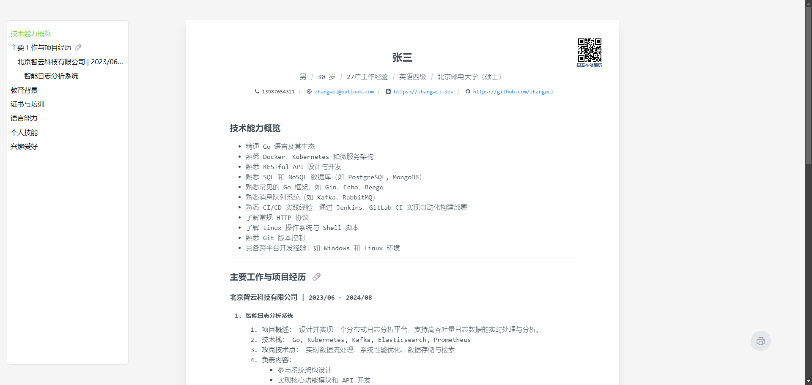
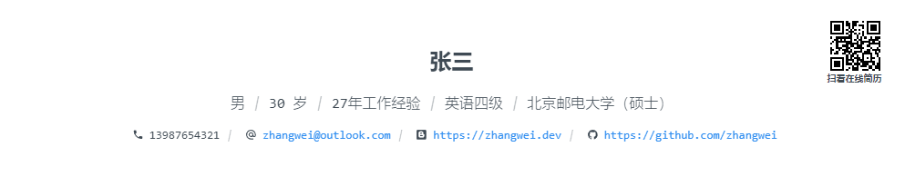

# resume-online

[toc]

一个超简单的在线 markdown 静态页面渲染，用来放放简历啦 (移动端已适配)。

>  based on vue3 + tailwind + node-express + nginx + docker


**首页：( / )**



支持密码保护


**管理编辑页 ：( /admin )**

实时修改你的简历


**超级管理员页面：（ /super ）**

设置访问密码，管理员密码，以及简历主题，文本字体，样式等。


**Visitors 访问统计页面：( /visitors)**

提供了基本的访问记录统计， 记录了访问时间，访问者ip, 城市等信息。


## How to use

Meta Data 编辑

你可以通过在 markdown 头部通过：
```markdown
---
---
```

写入 yaml 格式的元数据信息，目前支持两种类型的 meta 字段, 分别是 `profile`, 以及 `list` ; 字段名是任意的：

```yaml
---
foo:
  type: profile
  title: 张三
  subtitle:
  - label: 性别
    value: 男
  - label: 年龄
    value: 18
  - label: 住址
    value: 深圳

bar:
  type: list
  set:
    - label: Github
      value: https://github.com/zhangsan
      [icon]: <svg>...</svg> # <需要是一个形如 的 svg html字符串>
      [isLink]: true #布尔值, 如果为 true, value 将被当做链接
      [iconInside]: false #布尔值,仅isLink 为true 有效, 如果为 true, icon 将会在 a 连接中显示
      [hideValue]: true #布尔值, 仅isLink 为true 有效, 如果为 true, 将会隐藏 a 连接中的文本值
---
```


示例1：

```yaml
---
main:
  type: profile
  title: 张三
  subtitle:
    - label: 
      value: 男
    - label: 
      value: 30 岁
    - label: 
      value: 27年工作经验
    - label: 
      value: 英语四级
    - label: 
      value: 北京邮电大学（硕士）

contact:
  type: list
  set:
    - label: 
      value: 13987654321
      icon: <svg ..... </svg>
    - label: 
      icon: <svg ..... </svg>
      value: <a href="mailto:zhangwei@outlook.com">zhangwei@outlook.com</a>
    - label: 
      isLink: true
      icon: <svg ..... </svg>
      value: https://zhangwei.dev
    - label: 
      isLink: true
      icon: <svg ..... </svg>
      value: https://github.com/zhangwei
---
```

将会被解析渲染为下面的样式：



示例2：

```yaml
---
main:
  type: profile
  title: 张三
  subtitle:
    - label: 性别
      value: 男
    - label: 年龄
      value: 30 岁
    - label: 电话
      value: 13987654321
    - label: 教育经历
      value: 北京邮电大学（硕士）

contact:
  type: list
  set:
    - label: 
      isLink: true
      iconInside: true
      hideValue: true
      icon: <svg ..... </svg>
      value: zhangwei@outlook.com
    - label: 
      isLink: true
      iconInside: true
      hideValue: true
      icon: <svg ..... </svg>
      value: https://zhangwei.dev
    - label: 
      isLink: true
      iconInside: true
      hideValue: true
      icon: <svg ..... </svg>
      value: https://github.com/zhangwei
---
```

将会被解析渲染为下面的样式：


自定义与部署

- step1:  fork 这个项目

- step2:  修改 /docker-compose.yml 文件, 修改 `VITE_ROOT_PASSWD`，`VITE_APP_TITLE`,  `VITE_APP_LOGO`

  `VITE_ROOT_PASSWD` ： 仅生产环境可用，root 用户可以和 admin 密码一样，访问 `/admin`, `/super`, `/visitors` 页面。如果不设定，
  
  `VITE_APP_TITLE` ：你的简历页面的 Title
  
  `VITE_APP_LOGO` : 一个经过 base64 + dataURL 处理过的 svg 字符串， 你可以在 [这里](https://joisun.github.io/demos/Others/svgConvert/dist/) 进行转换。
  
  ```html
  services:
    resume-web:
      container_name: "resume-web"
      restart: always
      build:
        context: ./web/
        dockerfile: Dockerfile
        args:
          - VITE_ROOT_PASSWD=your-root-password
          - VITE_APP_TITLE=你的简历首页的 Title 
          - VITE_APP_LOGO=data:image/svg+xml;base64,PHN2ZyB4bWxucz0iaHR0cDovL3d3dy53My5vcmcvMjAwMC9zdmciIHdpZHRoPSIzMiIgaGVpZ2h0PSIzMiIgdmlld0JveD0iMCAwIDI0IDI0Ij48cGF0aCBmaWxsPSJjdXJyZW50Q29sb3IiIGQ9Im0xOC41IDIybC0xLjQtMy4xbC0zLjEtMS40bDMuMS0xLjRsMS40LTMuMWwxLjQgMy4xbDMuMSAxLjRsLTMuMSAxLjRsLTEuNCAzLjFaTTQgMTlWN2w4LTZsOCA2djQuMTc1cS0uMzc1LS4xLS43NjMtLjEzOFQxOC40NzYgMTFxLTIuNzI1IDAtNC42IDEuOVQxMiAxNy41cTAgLjM3NS4wMzguNzV0LjEzNy43NUg0WiIvPjwvc3ZnPg==
  ```


- step3: 登陆你的服务器, 然后找个地方 把 代码 clone 下来

  > 服务器 `git clone` 可能很慢， 建议先同步到 Gitee, 然后从 Gitee 中 clone

- step4: 执行：

  > ```bash
  > docker-compose up -d
  > ```
  >
  > ```bash
  > # 第一次执行需要等久一些，输出如下说明运行正常：
  > ......
  > ......
  > Creating mysql-db ... done
  > Creating resume-server ... done
  > Creating resume-web    ... done
  > ```
  >
  > ```bash
  > # 查看运行情况
  > docker ps
  > ```
  >
  > 
  >
  > 默认该 web 服务将会serve 在你服务器的 `83` 端口。

- 特别注意：

  1. 注意： admin 密码，如果不加设定，默认值为 "admin"， 简历页面的访问默认没有密码保护。

  2. 注意： 如果你需要部署在你自己的域名服务器，你需要做一层代理转发，还有nginx的一些相关配置，否则， /visitors 页面将无法正确记录访问者实际ip地址

     ```nginx
     # nginx.conf
     ......
      location / {
        proxy_pass http://localhost:83/;
        proxy_set_header X-Real-IP $remote_addr; 
        proxy_set_header X-Forwarded-For $remote_addr; #不可缺失，否则将无法正确追踪访问者ip
        proxy_set_header Host $http_host;
        proxy_set_header X-Nginx-Proxy true;
        proxy_set_header Connection "";
      }
     ......
     ```

     

## Troubles shooting

如果你自行修改了前端代码， 但是再线上服务器重新执行 `docker-compose down`, `docker-compose up -d` ， 但是前端没有刷新，可以在 根目录下执行一下命令 :

```bash
npm run docker:rebuild
```
你也可以手动单独打包前端项目

```bash
docker-compose build resume-web --no-cache
```

如果你手动修改了 init.sql 变更了数据表，你可能需要手动删除 ./mysql-data 先，否则可能不被覆盖

> 无需再次执行 docker-compose up


## TODO

- ~~支持密码访问~~

- ~~支持管理页面~~

- ~~支持管理页面背景图~~

- ~~访问记录页面~~

- ~~环境变量抽离到配置页面~~

- ~~访问记录分析统计图表~~

- ~~支持配置页面字体，主题样式（目前就一个默认主题）~~

- ~~支持页面title, icon 从部署阶段注入~~

- ~~支持meta 自定义渲染~~

- 添加更多主题（有空再加吧）

  

